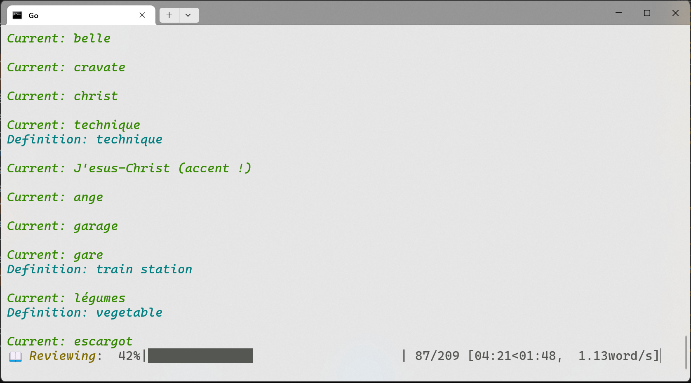
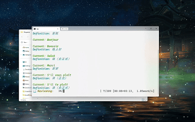

# Word Flash
A simple word review application for vocabulary learning.

## Demo
Watch it in action:




Full demo video available on [Bilibili](https://www.bilibili.com/video/BV1rB9vYGE8M/)

## Setup
Create a `word_list.txt` file with your vocabulary in this format:
```
word1
definition1
word2
definition2
...
```

## Controls
- `Enter`: Next word
- `L`: Show definition
- `R`: Previous word
- `Q`: Exit review mode
- `C`: Close application
- `G`: Go to some word directly

## How to Run
1. Direct method:
```bash
python word_start.py
```

2. Windows users:
	- Use the included `Go.bat` file (You should adjust its content to your Python path)
	- Double-click to launch