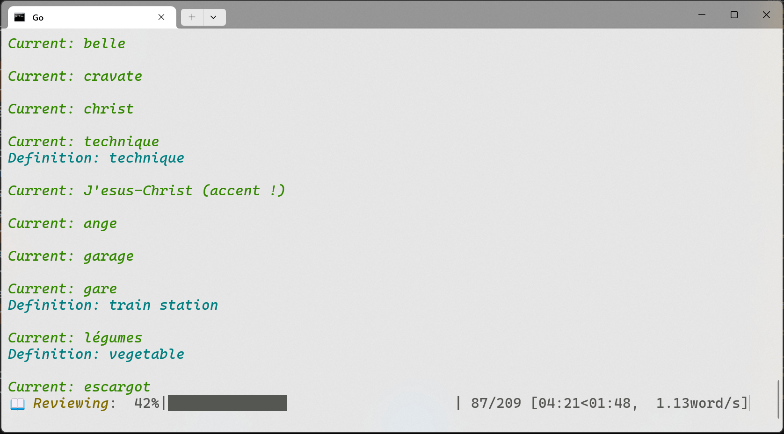
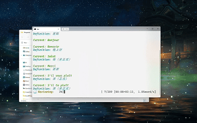

# Word Flash
A simple word review application for vocabulary learning.

## Demo
Watch it in action:




Full demo video available on [Bilibili](https://www.bilibili.com/video/BV1rB9vYGE8M/)

## Setup
Create a `word_list.txt` file with your vocabulary in this format:
```
word1
definition1
word2
definition2
...
```

## Controls
- `Enter`: Next word
- `L`: Show definition
- `R`: Previous word
- `Q`: Exit review mode
- `C`: Close application
- `G`: Go to some word directly

## How to Run
Some library you should install first:
Using:
```bash
pip install tqdm
```
or
```bash
pip3 install tqdm
```
Then


### 1. Direct method:

```bash
python word_start.py
```

or

```bash
python3 word_start.py
```

### 2. Windows users:
 Use the included `Go.bat` file (You should adjust its content to your Python path)
 Double-click to launch

### 3. For MacOS:
- Maybe you should create a virtual enivrement if you have a lot of pythons:
Run this command in your terminal of VScode:
  ```bash
   python3 -m venv .venv
   which python3
   pip3 install tqdm
  ```
  If it shows .venv/bin/python, then it works;

  If it doesn't work, use python/pip instead of python3/pip3

- Then run:
  ```bash
   chmod +x run.command
  ```

- Then you can just double click it to run it in MacOS